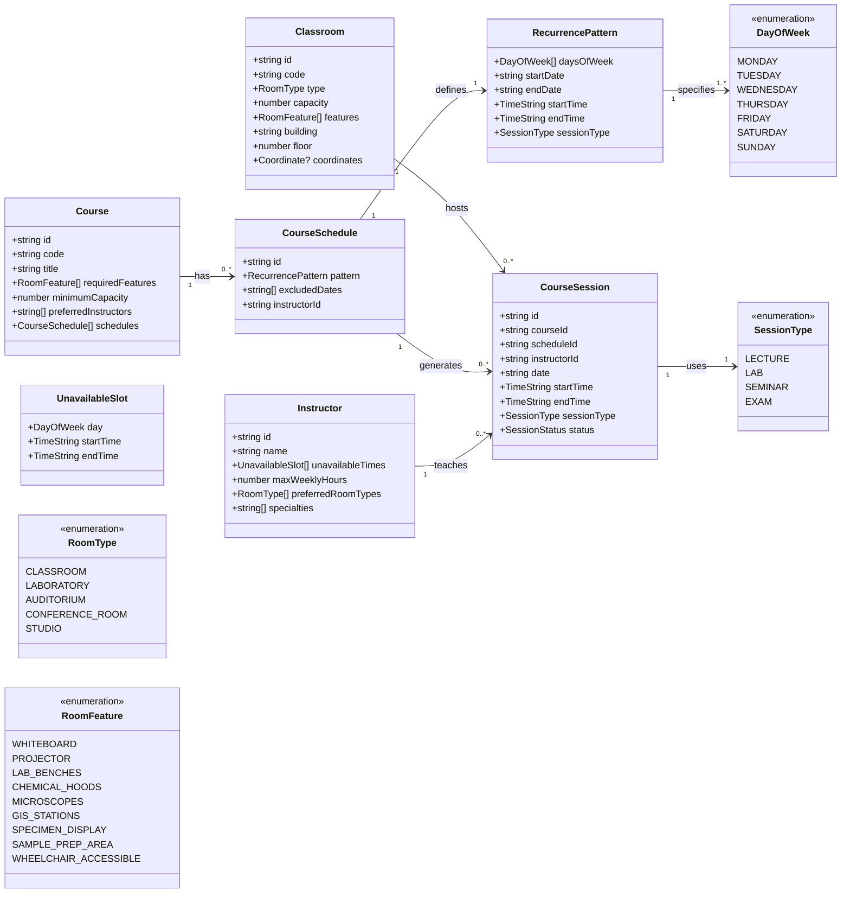

# Scheduling of Resources: Rooms and Instructors

## Terms Used in the Code

| Term | Description | Example |
|---|---|---|
| **Course** | Academic offering with fixed requirements | GEOL 232 - Mineralogy |
| **Schedule** | Recurring time pattern for course meetings | Every Tue/Thu 9:00-10:15 |
| **Session** | Single instance of a scheduled meeting | Tue Sep 5, 2023 9:00-10:15 |

## Type Definitions

### Diagram

Course
└─ schedules: CourseSchedule[]
   └─ timeSlots: RecurringTimeSlot[] (Tue/Thu patterns)
      └─ generates → CourseSession[] (individual dates)

Located in src/types.  There is a barrel used to combine these types, e.g. `import type { Classroom } from './types'`

### SessionTypes

Current kinds of Sessions are

  LECTURE, LAB, SEMINAR, EXAM, DISCUSSION

### CourseSchedule

###

----

# React + TypeScript + Vite

This template provides a minimal setup to get React working in Vite with HMR and some ESLint rules.

Currently, two official plugins are available:

- [@vitejs/plugin-react](https://github.com/vitejs/vite-plugin-react/blob/main/packages/plugin-react/README.md) uses [Babel](https://babeljs.io/) for Fast Refresh
- [@vitejs/plugin-react-swc](https://github.com/vitejs/vite-plugin-react-swc) uses [SWC](https://swc.rs/) for Fast Refresh

## Expanding the ESLint configuration

If you are developing a production application, we recommend updating the configuration to enable type-aware lint rules:

```js
export default tseslint.config({
  extends: [
    // Remove ...tseslint.configs.recommended and replace with this
    ...tseslint.configs.recommendedTypeChecked,
    // Alternatively, use this for stricter rules
    ...tseslint.configs.strictTypeChecked,
    // Optionally, add this for stylistic rules
    ...tseslint.configs.stylisticTypeChecked,
  ],
  languageOptions: {
    // other options...
    parserOptions: {
      project: ['./tsconfig.node.json', './tsconfig.app.json'],
      tsconfigRootDir: import.meta.dirname,
    },
  },
})
```

You can also install [eslint-plugin-react-x](https://github.com/Rel1cx/eslint-react/tree/main/packages/plugins/eslint-plugin-react-x) and [eslint-plugin-react-dom](https://github.com/Rel1cx/eslint-react/tree/main/packages/plugins/eslint-plugin-react-dom) for React-specific lint rules:

```js
// eslint.config.js
import reactX from 'eslint-plugin-react-x'
import reactDom from 'eslint-plugin-react-dom'

export default tseslint.config({
  plugins: {
    // Add the react-x and react-dom plugins
    'react-x': reactX,
    'react-dom': reactDom,
  },
  rules: {
    // other rules...
    // Enable its recommended typescript rules
    ...reactX.configs['recommended-typescript'].rules,
    ...reactDom.configs.recommended.rules,
  },
})
```
# scheduling_resources
