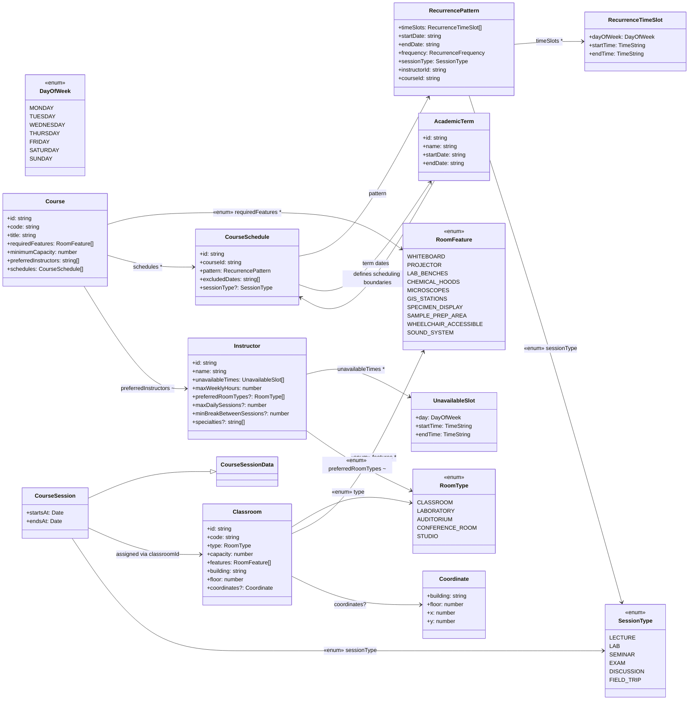

# Scheduling of Resources: Rooms and Instructors

## Terms Used in the Code

| Term | Description | Example |
|---|---|---|
| **Course** | Academic offering with fixed requirements | GEOL 232 - Mineralogy |
| **Schedule** | Recurring time pattern for course meetings | Every Tue/Thu 9:00-10:15 |
| **Session** | Single instance of a scheduled meeting | Tue Sep 5, 2023 9:00-10:15 |

## Type Definitions

### Diagram

Course
└─ schedules: CourseSchedule[]
   └─ timeSlots: RecurringTimeSlot[] (Tue/Thu patterns)
      └─ generates → CourseSession[] (individual dates)

Located in src/types.  There is a barrel used to combine these types, e.g. `import type { Classroom } from './types'`

### SessionTypes

Current kinds of Sessions are

  LECTURE, LAB, SEMINAR, EXAM, DISCUSSION

### CourseSchedule

###

# scheduling_resources
